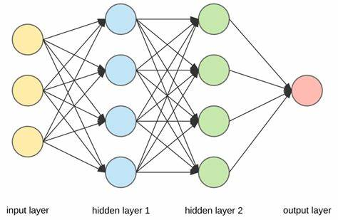
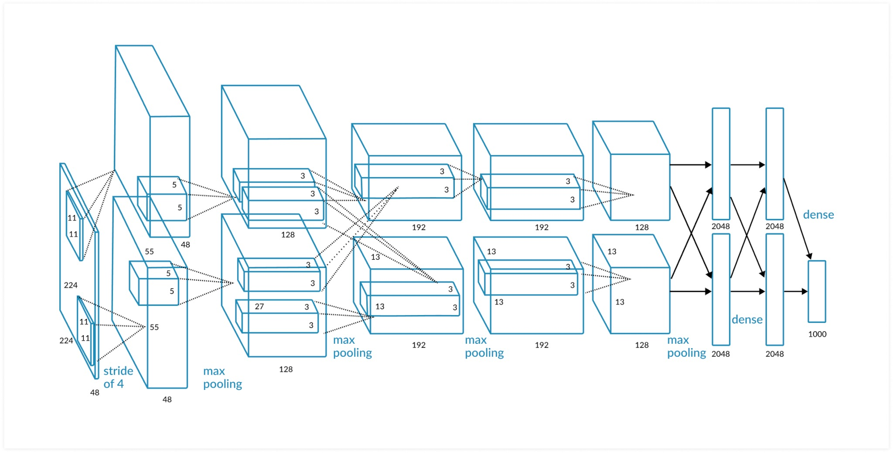

# 神经网络与深度学习

## 认识神经网络
神经网络 (Neural Network) 这个概念来自于生物体内的神经系统，神经系统由大量的神经元组成，每一个神经元都发挥着特定的功能，它们互相配合完成信号在体内的发送，传输与接收。后来，人们发明了“赛博神经系统”，也就是今天我们要讨论的神经网络。

在神经网络中也有类似于神经元的结构，不过它们是不同种类的函数，比如一个神经元可以做一次函数的输入输出。不同种类的神经元通过不同方式组合到一起就形成了神经网络，来完成不同的任务。

神经网络在刚搭建完成时不一定能够满足我们的需要，就像一个刚出生的婴儿什么也不懂，它需要接收一些信息才能进行学习，所以我们可以制作一个数据集让神经网络学会我们需要让它做的事，这个过程就是训练神经网络。以下是一个神经网络的示意图：

    

从上图可以看到，神经网络的层可以分为输入层，输出层和隐藏层，而隐藏层可以有多层。输入层负责接收输入的数据，传递给第一个隐藏层；隐藏层负责处理输入，其中的神经元之间的连接（图中的箭头）都包含了一个权重参数，简单地来说就是控制这个神经元的输出在它连接的神经元的输入中的占比，在训练过程中这一权重会被调整；输出层负责处理最后一个隐藏层的输出，呈现最终的结果。

总之，神经网络可以概括为一个**端到端的回归**，我们不需要把中间的每个细节都考虑清楚，而是在训练过程中，通过一些特定的算法使得输出基本上符合我们的预期。神经网络并不像一般的程序那样能够在程序本身正确的情况下输出绝对正确的结果，而是“猜”出一个结果，只不过合格的神经网络“猜”中的概率比较大。

## 神经网络的作用
对于神经网络而言，常见的任务有预测、分类、聚类等等（由于这个领域的发展速度太快，暂时还没找到一个关于“神经网络能做什么”的权威概括）。运用神经网络，通过房屋的面积，地段，房间数来预测房价可以看作是回归预测。用不同种类的图片，比如汽车，房子，猫，狗，来训练神经网络，然后我们输入一张图片，例如一张不在训练用的数据集中的猫的图片，让它给出它的分类属于分类任务。又或者我们有一些数据，让神经网络将它们按照相同的类别分开，这就是聚类任务。

## 为什么是深度学习？
上文我们已经提到，神经元之间的连接包含了权重参数，这个参数是可以更改的，也就是可学习参数，可学习的参数越多，我们就说这个模型的容量越大，能力通常也就越强，现在有的大语言模型 (Large Language Model, LLM) 后面加的6B，10B等就代表着参数量。

讲完了参数量这个事之后我们再回到为什么会产生深度学习上面，正如上图所表示的，早期的神经网络层数比较少，网络结构相对简单，参数量也比较少。这就导致了，在面对复杂任务时，参数量不够用了，好像“脑容量”不足以完成这个任务。解决这个问题的方法自然就是加深网络，通过增加层数的方法来增大参数量，从而适应更加复杂的任务。这也就是深度学习的深度二字的来源，层数比较多的神经网络后来也被称作深度神经网络。

然而，深度学习起初并没有像现在这样得到如此多的关注，一直默默无闻。直到2012年，谷歌的ImageNet图像分类挑战中，AlexNet横空出世。这个在当时成为SOTA (State of the art, 最先进的) 的模型有着较大的参数量和较好的表现，使得人们开始关注到深度学习的巨大潜力。下图是AlexNet的示意图，它是一个卷积神经网络 (Convolutional Neural Network, CNN)，跟上文讨论的神经网络有些不同，这部分知识将会在后续呈现给大家。

    

## 总结
本文主要介绍了神经网络和深度学习的基本概念和应用。神经网络是一种模仿生物体内的神经系统的算法，可以通过调整它的结构和在训练过程中改变其中的参数来得到较为理想的结果。神经网络的常见任务包括预测、分类和聚类等。

在传统神经网络与机器学习算法无法满足日益复杂的任务需求时，人们增加网络的层数，将网络的结构变得更加复杂，借此提高网络的参数量来完成复杂的任务。深度学习的重要性在2012年谷歌的ImageNet图像分类挑战中得到了证明，当时的最先进模型AlexNet展示了深度学习的巨大潜力。
