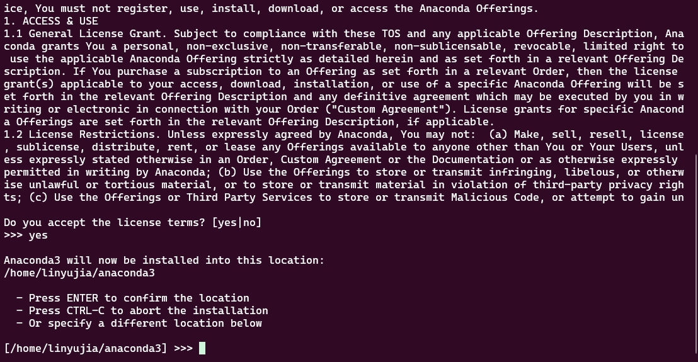
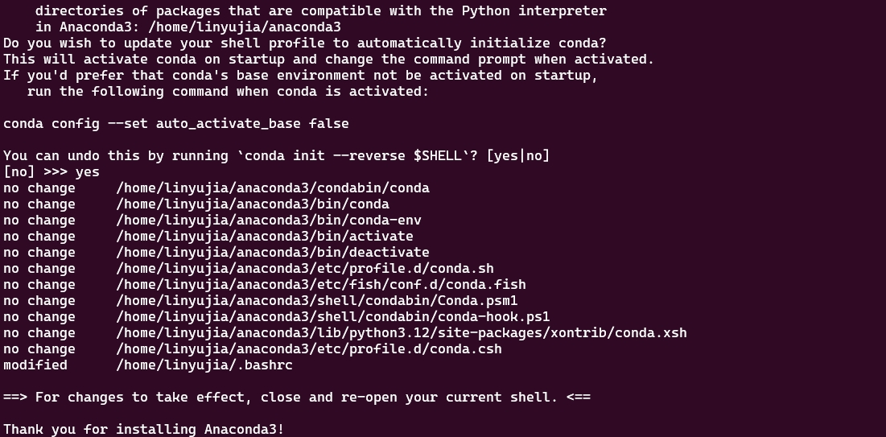
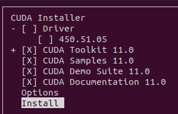

# 环境配置

## 选择操作系统

### Windows
作为最广为流传的操作系统，在Windows上配置深度学习的环境相对容易。但是，由于在度过新手入门的阶段之后，会发现大多数的开源项目，包括论文的代码都是需要用Linux系统运行的，所以Windows也许是一个不错的入门之选，但并不是一个适合我们长期使用的操作系统。

### Linux
Linux系统，尤其是Ubuntu系统，是科研界常用的操作系统，在习惯了之后，抛开有的软件不兼容和不适合小白的问题，甚至会比Windows更加好用。使用Linux系统最好另外找一台电脑，Windows和Linux双系统也许会导致一些问题，并且切换系统需要重启电脑。如果想使用Linux系统，我推荐Ubuntu 20.04版本，相对稳定而且使用者比较多，大部分的问题都可以通过查阅资料解决。

### Windows+WSL+Ubuntu
这个缝合怪也是逐渐开始流行，它结合了Windows和Linux的优点，是一个与Windows宿主机共用硬件，驱动和文件资源管理器的解决方案。但缺点是没有纯Ubuntu系统那样的UI，除了通过用Windows的文件资源管理器操作文件以外，只能用命令行操作（虽然我用真的Ubuntu系统也是只用图形化界面拖个文件），也许对小白更加不友好。

基于以上的优缺点，你可以选择一个你喜欢的操作系统，然后查阅相关资料，按照教程一步步安装。

## 安装Anaconda
由于我平时使用服务器比较多，所以我这里就以我们的服务器上使用的Ubuntu 20.04系统为例，来进行Anaconda的安装的介绍，使用WSL也是一样的。Anaconda是一个开源的Python发行版本，包含了Python、NumPy、SciPy、Matplotlib、pandas等常用数据科学库。由于官网在国外，众所周知，我们是不能直接快速下载的，所以我们使用[清华镜像](https://mirrors.tuna.tsinghua.edu.cn/anaconda/archive/)的Anaconda安装包，打开链接之后根据自己的系统选一个较新的安装包进行下载即可。

>Ubuntu系统和Windows系统是x86_64架构的，如果是其他架构的系统，请自行下载对应版本的Anaconda。

下载好安装包之后，我们开始安装Anaconda。首先进入指定目录运行安装脚本：
```
# 记得改这里的路径
cd /path/to/anaconda/directory
# 这里输入Anaconda之后按Tab键，会自动补全文件名
bash Anaconda3-xxxx.xx-Linux-x86_64.sh
```
然后根据终端的提示按回车，回出现以下的用户协议：

<div align="center">
    
</div>

这里按q可以直接退出，然后根据提示输入yes，回车，会看到以下内容：

<div align="center">
    
</div>

这里就是Anaconda的安装路径，如果是像我一样的/home/username/anaconda3目录，就直接按回车，如果不是这样的形式，推荐修改成这个样子。等待安装完成之后，终端会提示你是否要修改终端的样式，显示当前所在的Anaconda虚拟环境的名字，这里输入yes然后回车，就安装完成了。

<div align="center">
    
</div>

## 常用的Anaconda命令
1. conda version：查看conda版本
2. conda info：查看conda配置信息
3. conda list：查看已安装的包
4. conda create -n env_name python=3.x：创建新的conda环境，这里的python=3.x可以指定python版本
5. conda activate env_name：激活conda环境
6. conda deactivate：退出当前激活的conda环境
7. conda remove -n env_name：删除conda环境
8. conda install package_name：安装conda包
9. conda update package_name：更新conda包
10. conda search package_name：搜索conda包

## Anaconda换源
由于国内网络问题，经常会出现下载包很慢，或者根本无法下载的情况。如果给Anaconda更换下载源，就可以一定程度上缓解这一问题，举个例子，我们换成清华镜像的源。
1. 打开`.condarc`文件，WSL用户直接打开`/home/username`目录就可以看到，Ubuntu用户需要在这个目录下按下`Ctrl+H`显示隐藏文件，或者使用`sudo gedit .condarc`命令打开文件编辑器。然后我们将文件内容替换为以下的内容：
```
channels:
  - defaults
show_channel_urls: true
default_channels:
  - https://mirrors.tuna.tsinghua.edu.cn/anaconda/pkgs/main
  - https://mirrors.tuna.tsinghua.edu.cn/anaconda/pkgs/r
  - https://mirrors.tuna.tsinghua.edu.cn/anaconda/pkgs/msys2
custom_channels:
  conda-forge: https://mirrors.tuna.tsinghua.edu.cn/anaconda/cloud
  pytorch: https://mirrors.tuna.tsinghua.edu.cn/anaconda/cloud
```
2. 保存文件并退出，然后运行`conda clean -i`清理下载缓存

参考文献：[Anaconda软件仓库镜像使用帮助](https://help.mirrors.cernet.edu.cn/anaconda/)。  
这个文档里也包含了Windows用户换源的方法。另外，并不一定要使用清华源，可以换成一个离得近的源，速度也非常快。

## 安装CUDA
CUDA是深度学习的加速器，它可以让我们在GPU上运行深度学习算法，提高运算速度。

首先我们需要运行`nvcc -V`来查看我们是否已经安装了CUDA，如果没有出现CUDA版本号，就需要我们安装CUDA。

>**CUDA版本并不是越高越好，根据我的经验，现在11.3版本的兼容性比较好，CUDA 12.x版本的兼容性不太好，所以建议安装11.3版本的CUDA。**

1. 以CUDA 11.3为例，从[NVIDIA官网](https://developer.nvidia.com/cuda-toolkit-archive)下载CUDA Toolkit的.run文件，根据系统版本选择正确的选项
2. 开始安装CUDA前先安装依赖
```
sudo apt-get install freeglut3-dev build-essential libx11-dev libxmu-dev libxi-dev libgl1-mesa-glx libglu1-mesa libglu1-mesa-dev
```
3. 运行刚才官网下方显示的指令完成.run文件的下载与安装
```
wget https://developer.download.nvidia.com/compute/cuda/11.3.0/local_installers/cuda_11.3.0_465.19.01_linux.run
sudo sh cuda_11.3.0_465.19.01_linux.run
```
4. 出现下图时取消勾选安装显卡驱动，然后开始安装

<div align="center">
    
</div>

>如果是还没有安装显卡驱动的Ubuntu系统，需要先安装显卡驱动，本文不介绍安装显卡驱动的方法。

5. 配置环境变量与验证是否安装成功
   1. 配置环境变量，在终端中输入以下命令
      ```
      export PATH=$PATH:/usr/local/cuda/bin  
      export LD_LIBRARY_PATH=$LD_LIBRARY_PATH:/usr/local/cuda/lib64  
      export LIBRARY_PATH=$LIBRARY_PATH:/usr/local/cuda/lib64
      source ~/.bashrc
      ```
    2. 验证是否安装成功：在终端中输入`nvcc -V`命令，出现版本号即为安装成功。


## 安装cuDNN
cuDNN是CUDA的深度神经网络加速库，它可以加速卷积神经网络的运算。

1. 以cuDNN 9.2.0为例，从[NVIDIA官网](https://developer.nvidia.com/cudnn-downloads)下载cuDNN的.deb文件，根据系统版本选择正确的选项。
2. 安装cuDNN，运行以下命令
   
```
wget https://developer.download.nvidia.com/compute/cudnn/9.2.0/local_installers/cudnn-local-repo-ubuntu2004-9.2.0_1.0-1_amd64.deb
sudo dpkg -i cudnn-local-repo-ubuntu2004-9.2.0_1.0-1_amd64.deb
sudo cp /var/cudnn-local-repo-ubuntu2004-9.2.0/cudnn-*-keyring.gpg /usr/share/keyrings/
sudo apt-get update
# 下面的命令需要根据CUDA版本修改，CUDA 12.x就把11改成12
sudo apt-get -y install cudnn-cuda-11
```

## 安装PyTorch
PyTorch是一个开源的深度学习框架，它可以让我们更方便地进行深度学习的开发。在本系列的接下来的内容中，我们也会使用这套框架。

1. 首先创建一个conda环境，运行以下命令。这里环境的名字可以随意改，python的版本最好不要变，根据我的经验，3.8的兼容性是最好的，基本不会在安装package的时候出现兼容性问题。
```
conda create -n pytorch python=3.8
```
2. 激活刚才创建的conda环境，运行以下命令
```
conda activate pytorch
```
3. 访问[PyTorch官网](https://pytorch.org/)查看安装命令，同样的，根据系统和CUDA版本选择正确的命令，并且选择Python版本，通过Conda安装。比如以下是安装了CUDA 12.1及以上的Linux系统安装PyTorh的命令：
```
conda install pytorch torchvision torchaudio pytorch-cuda=12.1 -c pytorch -c nvidia
```
4. 根据提示完成安装以后，运行`conda list`，如果能看到pytorch，torchvision，torchaudio等包，则说明安装成功。